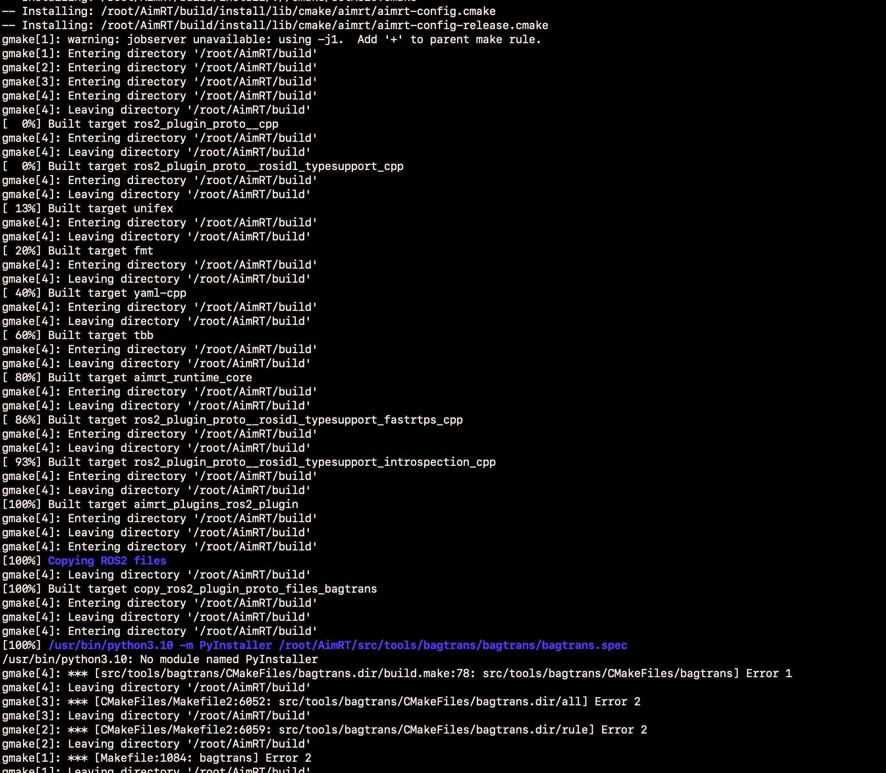

# Docker编译AimRT

#### docker环境
    提供docker环境
    https://github.com/flyShiheng/AimRT_Benchmark/blob/main/Dockerfile
    也可以直接使用脚本
    https://github.com/flyShiheng/AimRT_Benchmark/blob/main/set_up.sh

#### 构建docker环境，支持x86和arm64，创建一个名为ubuntu_test的docker镜像
    docker build --progress=plain -t ubuntu_test .

#### 启动docker容器
    docker run -it ubuntu_test  
    docker run -it -v path_in_host:path_in_docker ubuntu_test  

#### 加载ros环境
    source /opt/ros/humble/setup.bash

#### 编译AimRT
    bash build.sh

