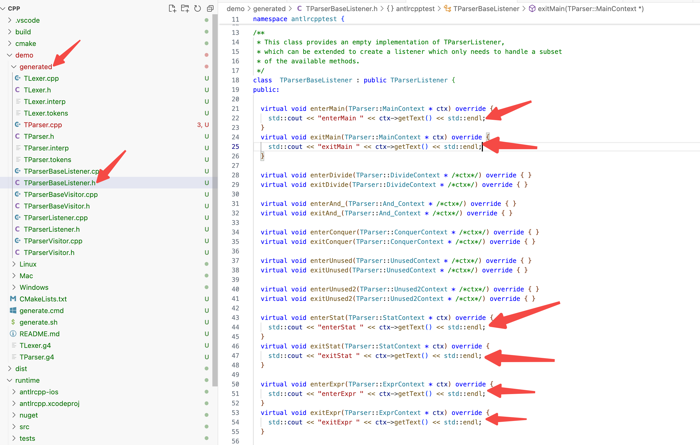
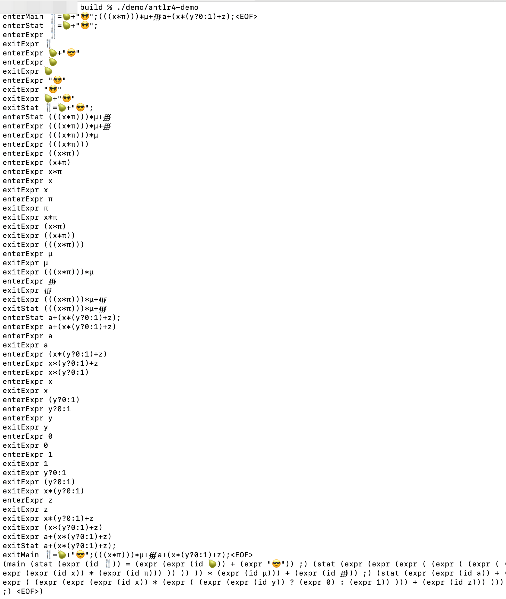
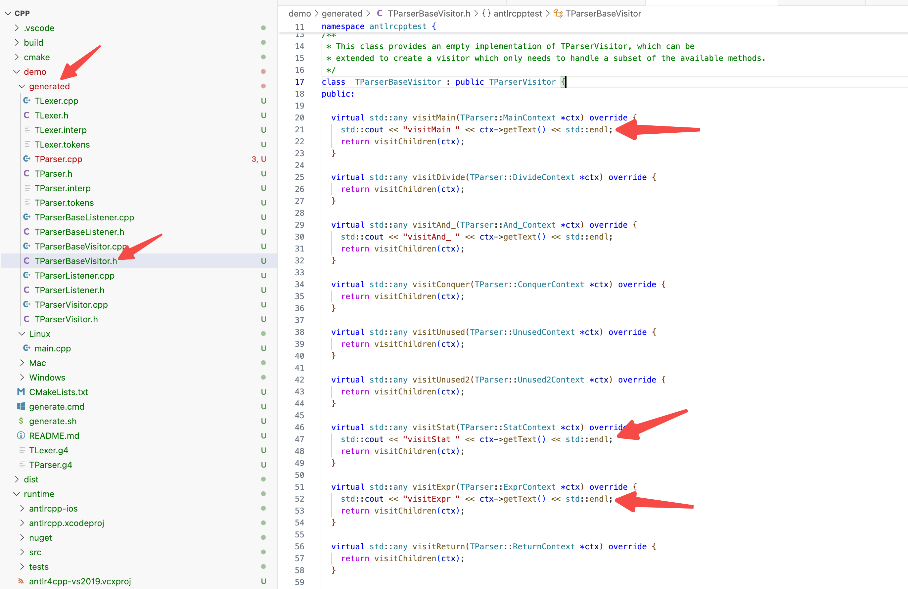
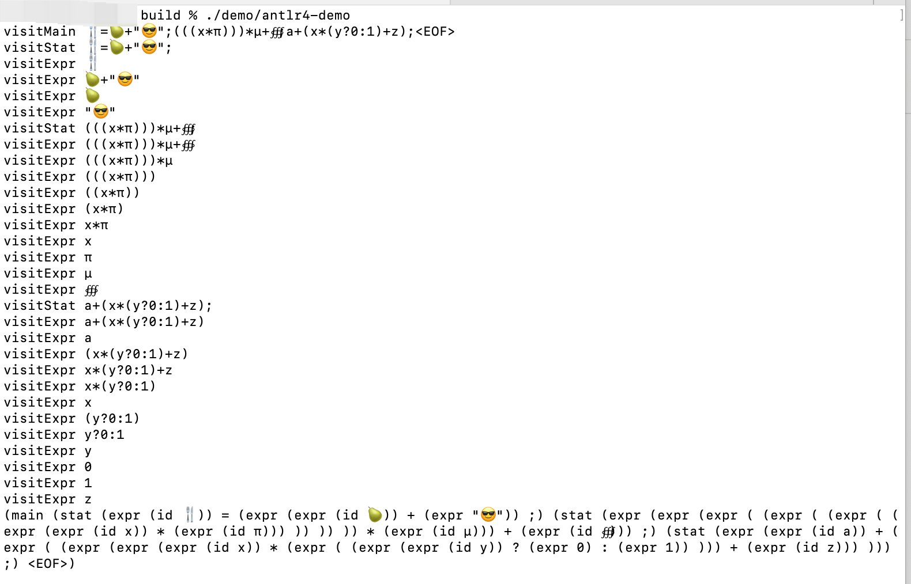

# CPP版本使用

## 编译
    git clone https://github.com/antlr/antlr4.git
    cd antlr4/runtime/Cpp
    wget https://www.antlr.org/download/antlr-4.13.2-complete.jar
    mkdir build && cd build
    cmake .. -DANTLR_JAR_LOCATION=/Users/shihenghuang/source/antlr4-dev/runtime/Cpp/antlr-4.13.2-complete.jar -DWITH_DEMO=True
    make -j16

编译完毕，执行demo程序 ./demo/antlr4-demo

    

## 使用Listener
    修改demo/generated/TParserBaseListener.h里面的内容，在对应函数里面添加一些信息打印，观察程序的执行情况


``` cpp
int main(int , const char **) {
  ANTLRInputStream input(u8"🍴 = 🍐 + \"😎\";(((x * π))) * µ + ∰; a + (x * (y ? 0 : 1) + z);");
  TLexer lexer(&input);
  CommonTokenStream tokens(&lexer);
  TParser parser(&tokens);
  tree::ParseTree* tree = parser.main();

  TParserBaseListener listener;
  tree::ParseTreeWalker::DEFAULT.walk(&listener, tree);

  std::cout << tree->toStringTree(&parser) << std::endl << std::endl;

  return 0;
}
```


## 使用Visitor
    修改demo/generated/TParserBaseVisitor.h里面的内容，在对应函数里面添加一些信息打印，观察程序的执行情况

``` cpp
int main(int , const char **) {
  ANTLRInputStream input(u8"🍴 = 🍐 + \"😎\";(((x * π))) * µ + ∰; a + (x * (y ? 0 : 1) + z);");
  TLexer lexer(&input);
  CommonTokenStream tokens(&lexer);
  TParser parser(&tokens);
  tree::ParseTree* tree = parser.main();

  TParserBaseVisitor visitor;
  visitor.visit(tree);

  std::cout << tree->toStringTree(&parser) << std::endl << std::endl;

  return 0;
}
```

